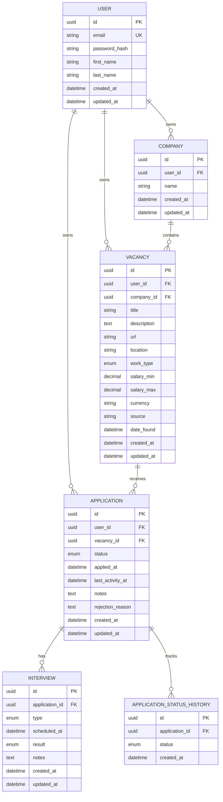

# JobFlow Database

This document describes the database architecture of JobFlow.

JobFlow uses PostgreSQL as its relational database and Prisma as the ORM.

The database is designed around the job application lifecycle:

```text
User
 ├── Company
 │    └── Vacancy
 │         └── Application
 │              ├── Interview
 │              └── ApplicationStatusHistory
```

## Database Entities

JobFlow currently contains six core entities:

1. `User`
2. `Company`
3. `Vacancy`
4. `Application`
5. `Interview`
6. `ApplicationStatusHistory`

---

## 1. User

`User` represents the owner of personal job-search data.

### Main fields

| Field           | Type     | Constraints       |
| --------------- | -------- | ----------------- |
| `id`            | UUID     | Primary key       |
| `email`         | String   | Unique, lowercase |
| `password_hash` | String   | Required          |
| `first_name`    | String   | Required          |
| `last_name`     | String   | Required          |
| `created_at`    | DateTime | Required          |
| `updated_at`    | DateTime | Required          |

### Responsibilities

A user owns:

* companies;
* vacancies;
* applications;
* related job-search data.

---

## 2. Company

`Company` represents a company associated with a vacancy.

### Main fields

| Field        | Type     | Constraints          |
| ------------ | -------- | -------------------- |
| `id`         | UUID     | Primary key          |
| `user_id`    | UUID     | Foreign key → `User` |
| `name`       | String   | Required             |
| `created_at` | DateTime | Required             |
| `updated_at` | DateTime | Required             |

### Constraints

A user cannot have duplicate company names.

```text
UNIQUE(user_id, name)
```

---

## 3. Vacancy

`Vacancy` represents a job position.

### Main fields

| Field         | Type     | Constraints                  |
| ------------- | -------- | ---------------------------- |
| `id`          | UUID     | Primary key                  |
| `user_id`     | UUID     | Foreign key → `User`         |
| `company_id`  | UUID     | Foreign key → `Company`      |
| `title`       | String   | Required                     |
| `description` | Text     | Optional                     |
| `url`         | String   | Optional                     |
| `location`    | String   | Optional                     |
| `work_type`   | Enum     | `REMOTE`, `HYBRID`, `ONSITE` |
| `salary_min`  | Decimal  | Optional                     |
| `salary_max`  | Decimal  | Optional                     |
| `currency`    | String   | Optional                     |
| `source`      | String   | Optional                     |
| `date_found`  | DateTime | Required                     |
| `created_at`  | DateTime | Required                     |
| `updated_at`  | DateTime | Required                     |

A vacancy belongs to both a user and a company.

The explicit `user_id` makes ownership queries and authorization checks straightforward.

---

## 4. Application

`Application` is the central entity of the job-search system.

It connects a user with a vacancy and represents the current state of the application process.

### Main fields

| Field              | Type     | Constraints                |
| ------------------ | -------- | -------------------------- |
| `id`               | UUID     | Primary key                |
| `user_id`          | UUID     | Foreign key → `User`       |
| `vacancy_id`       | UUID     | Foreign key → `Vacancy`    |
| `status`           | Enum     | Current application status |
| `applied_at`       | DateTime | Optional                   |
| `last_activity_at` | DateTime | Required                   |
| `notes`            | Text     | Optional                   |
| `rejection_reason` | Text     | Optional                   |
| `created_at`       | DateTime | Required                   |
| `updated_at`       | DateTime | Required                   |

### Current status

The application status represents the **current state** of the application.

```text
SAVED
  ↓
APPLIED
  ↓
HR_INTERVIEW
  ↓
TECHNICAL_INTERVIEW
  ↓
FINAL_INTERVIEW
  ↓
OFFER
```

Alternative terminal states:

```text
REJECTED
WITHDRAWN
```

The application stores only the current status.

Historical status changes are stored separately in `ApplicationStatusHistory`.

### Uniqueness

A user should not create multiple applications for the same vacancy:

```text
UNIQUE(user_id, vacancy_id)
```

---

## 5. Interview

`Interview` represents an interview connected to an application.

### Interview types

```text
HR
TECHNICAL
LIVE_CODING
HIRING_MANAGER
FINAL
OTHER
```

### Results

```text
PENDING
PASSED
FAILED
CANCELLED
```

### Main fields

| Field            | Type     | Constraints                 |
| ---------------- | -------- | --------------------------- |
| `id`             | UUID     | Primary key                 |
| `application_id` | UUID     | Foreign key → `Application` |
| `type`           | Enum     | Required                    |
| `scheduled_at`   | DateTime | Optional                    |
| `result`         | Enum     | Required                    |
| `notes`          | Text     | Optional                    |
| `created_at`     | DateTime | Required                    |
| `updated_at`     | DateTime | Required                    |

An application can have multiple interviews.

---

## 6. ApplicationStatusHistory

`ApplicationStatusHistory` stores every status transition of an application.

### Main fields

| Field            | Type     | Constraints                 |
| ---------------- | -------- | --------------------------- |
| `id`             | UUID     | Primary key                 |
| `application_id` | UUID     | Foreign key → `Application` |
| `status`         | Enum     | Application status          |
| `created_at`     | DateTime | Required                    |

The history table allows JobFlow to answer questions such as:

* When was an application submitted?
* How long did an application stay in HR?
* How long did it take to reach a technical interview?
* How many applications reached an offer?
* Where do applications most frequently fail?

---

# Entity Relationships

## User → Company

```text
User 1 ──────── N Company
```

One user can own multiple companies.

Each company belongs to one user.

---

## User → Vacancy

```text
User 1 ──────── N Vacancy
```

One user can save multiple vacancies.

Each vacancy belongs to one user.

---

## Company → Vacancy

```text
Company 1 ──────── N Vacancy
```

A company can have multiple vacancies.

Each vacancy belongs to one company.

---

## User → Application

```text
User 1 ──────── N Application
```

One user can have multiple applications.

Each application belongs to one user.

---

## Vacancy → Application

```text
Vacancy 1 ──────── N Application
```

A vacancy can have applications from different users.

For a single user, the combination is unique:

```text
(user_id, vacancy_id)
```

---

## Application → Interview

```text
Application 1 ──────── N Interview
```

An application can have multiple interviews.

---

## Application → StatusHistory

```text
Application 1 ──────── N ApplicationStatusHistory
```

An application can have many historical status records.

---

# ERD



# Application Current-State Model

`Application.status` represents the application's **current state**.

For example:

```text
Application
└── status = TECHNICAL_INTERVIEW
```

This means the application is currently at the technical interview stage.

The current state should be easy and fast to query:

```text
Application.status
```

It should not be reconstructed by scanning the entire status history.

---

# Status-History Model

The history table records transitions separately.

Example:

```text
Application
status = TECHNICAL_INTERVIEW
```

History:

```text
2026-09-01  SAVED
2026-09-02  APPLIED
2026-09-05  HR_INTERVIEW
2026-09-09  TECHNICAL_INTERVIEW
```

This gives the system two complementary models:

```text
Current state
Application.status
       │
       ▼
"Where is the application now?"

Historical state
ApplicationStatusHistory
       │
       ▼
"How did the application get here?"
```

This separation is important for analytics.

---

# Ownership Model

User-owned entities explicitly contain `user_id`:

```text
User
 ├── Company.user_id
 ├── Vacancy.user_id
 └── Application.user_id
```

This provides a clear ownership boundary.

## Ownership rules

A user can access only their own:

* companies;
* vacancies;
* applications.

Related records are accessed through their parent entity.

For example:

```text
User
  ↓
Application
  ↓
Interview
```

An interview does not need a separate `user_id` because ownership is inherited through the application.

Similarly:

```text
User
  ↓
Company
  ↓
Vacancy
```

The vacancy has explicit `user_id` because vacancies are user-owned resources and this makes authorization and filtering simpler.

---

# Delete Behavior

The database uses the following delete rules.

## User → Company

```text
CASCADE
```

Deleting a user deletes their companies.

## User → Vacancy

```text
CASCADE
```

Deleting a user deletes their vacancies.

## User → Application

```text
CASCADE
```

Deleting a user deletes their applications.

## Company → Vacancy

```text
RESTRICT
```

A company cannot be deleted while vacancies reference it.

## Vacancy → Application

```text
RESTRICT
```

A vacancy cannot be deleted while applications reference it.

## Application → Interview

```text
CASCADE
```

Deleting an application deletes its interviews.

## Application → StatusHistory

```text
CASCADE
```

Deleting an application deletes its status history.

This preserves referential integrity and prevents orphaned records.

---

# Main Indexes

The database should index the fields used frequently for lookups, authorization, relationships, and sorting.

## User

```text
UNIQUE(email)
```

Used for authentication and user lookup.

## Company

```text
INDEX(user_id)
UNIQUE(user_id, name)
```

Used for user-owned company queries and duplicate prevention.

## Vacancy

```text
INDEX(user_id)
INDEX(company_id)
```

Used for:

* user's vacancies;
* company vacancies;
* ownership checks.

## Application

```text
INDEX(user_id)
INDEX(vacancy_id)
INDEX(status)
INDEX(last_activity_at)
UNIQUE(user_id, vacancy_id)
```

These support:

* user's applications;
* vacancy applications;
* filtering by status;
* sorting by recent activity;
* preventing duplicate applications.

## Interview

```text
INDEX(application_id)
INDEX(scheduled_at)
```

Used for application interview lookup and upcoming interview queries.

## ApplicationStatusHistory

```text
INDEX(application_id)
INDEX(created_at)
```

Used for retrieving an application's history in chronological order.

---

# Migration Workflow

Prisma migrations are the source-controlled representation of database schema changes.

## 1. Modify the Prisma schema

Update the schema in the API application.

```text
apps/api/prisma/schema.prisma
```

## 2. Validate the schema

```bash
pnpm --filter api exec prisma validate
```

## 3. Generate Prisma Client

```bash
pnpm --filter api exec prisma generate
```

## 4. Create a development migration

```bash
pnpm --filter api exec prisma migrate dev --name <migration-name>
```

Example:

```bash
pnpm --filter api exec prisma migrate dev --name add_application_status_history
```

## 5. Review the generated migration

Migration files are stored in:

```text
apps/api/prisma/migrations/
```

Review generated SQL before committing it.

## 6. Test the application

Run the backend:

```bash
pnpm --filter api start:dev
```

Verify:

```text
GET /health
```

The response should confirm that the API can connect to PostgreSQL.

## 7. Commit the migration

Migration files must be committed to Git together with the schema changes.

```text
schema.prisma
migrations/
```

## Production / Deployment

For an existing database, apply committed migrations with:

```bash
pnpm --filter api exec prisma migrate deploy
```

Do not use `migrate dev` as the production migration workflow.

## Migration Rules

1. Every schema change must have a migration.
2. Do not manually modify an already-applied migration.
3. Give migrations descriptive names.
4. Review generated SQL.
5. Commit migrations to Git.
6. Run `prisma generate` after schema changes.
7. Use `prisma migrate deploy` for deployment.
8. Never commit real database credentials.

---

# Database Architecture Summary

```text
                 ┌─────────────┐
                 │    User     │
                 └──────┬──────┘
                        │
             ┌──────────┼──────────┐
             ▼          ▼          ▼
        ┌────────┐ ┌─────────┐ ┌────────────┐
        │Company │ │ Vacancy │ │Application │
        └────┬───┘ └────┬────┘ └─────┬──────┘
             │          │             │
             └──────────┘       ┌─────┴─────┐
                                ▼           ▼
                           ┌─────────┐ ┌──────────────┐
                           │Interview│ │StatusHistory │
                           └─────────┘ └──────────────┘
```

The design separates:

* **ownership** — `User`;
* **company data** — `Company`;
* **job opportunities** — `Vacancy`;
* **current application state** — `Application`;
* **interview events** — `Interview`;
* **historical state changes** — `ApplicationStatusHistory`.

This structure is intentionally focused on the MVP and leaves room for future features without introducing unnecessary entities.
